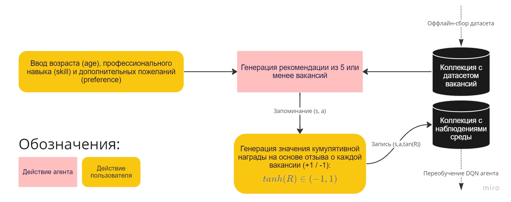

# vacancy_recommender
Репозиторий посвящен разработке рекомендательной системы вакансий на основе RL-алгоритма DQN.

---
### Общий воркфлоу

### Сбор датасета вакансий
Данные для обучения (`./backend/dataset.xlsx`) были собраны с портала hh.ru по поисковому запросу "художник" посредством асинхронного веб-скрейпинга. Подробнее об алгоритме сбора, предобработке и описательном анализе можно прочитать в ноутбуке ["Preprocessing & EDA"](https://github.com/turkunov/vacancy_recommender/blob/main/research/preprocessing_eda.ipynb). Далее собранный датасет был загружен в коллекцию на mongoDB кластере с помощью `./backend/upload_dataset.py`.

### Архитектура DQN-агента
В основе DQN агента лежит простая нейронная сеть (где N - число возможных действий (рекомендаций профессиональных сфер) агента, хранящихся в `config.json`): 

### Процес обучения DQN-агента
Для оффлайн-обучения агента было сгенерировано 5000 случайных наблюдений формата `(state,action,reward)`. Затем был запущен цикл обучения по батчам размера 32 на 1000 эпизодов. В качестве функции потерь была выбрана функция Хьюбера. Подробнее о процессе обучения можно прочитать в ноубуке ["Разработка DQN-агента"](https://github.com/turkunov/vacancy_recommender/blob/main/research/dqn_agent.ipynb).

### Интеграция с REST API
Для взаимодействия агента с пользователем-средой был написан REST API на fastAPI с эндпоинтами:
* `GET /api/recommend/{age: int}&{skill: str}&{preference: str}`: GET-эндпоинт для генерации рекомендации на основе состояния среды, являющейся массивом [`age`, `skill`]. Рекомендованные агентом вакансии затем сортируются на основе косинусного сходства между `preference` и описаниями вакансий на основе TF-IDF эмбеддинга.
* `POST /api/write/`: POST-эндпоинт который принимает JSON-тело `{cum_reward, age, skill, action}` и затем записывает его в базу данных для наблюдений среды с целью дальнейшего переобучения DQN-агента.
