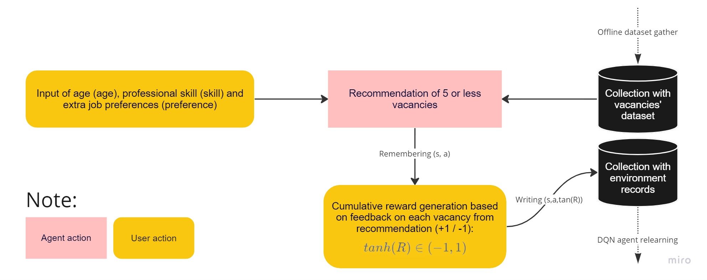

## vacancy_recommender
##### This repository is related to the development of DQN-based recommendation engine.

---
### System's workflow:

### Collecting a job dataset
Training data (`./backend/dataset.xlsx `) was collected from the hh.ru portal according to the search query "artist" by asynchronous web scraping. You can read more about the collection algorithm, preprocessing and exploratory data analysis in the notebook ["Preprocessing & EDA"](https://github.com/turkunov/vacancy_recommender/blob/main/research/preprocessing_eda.ipynb). Next, the collected dataset was uploaded to the collection on the MongoDB cluster using `./backend/upload_dataset.py `.

### DQN Agent architecture
The agent's DQN is based on a simple neural network (where N is the number of possible actions (recommendations of professional spheres) of the agent stored in `config.json`):

### The process of training a DQN agent
For the sake of demonstration 5000 random observations `(state,action,reward)` were generated for offline agent training. Then a training cycle was launched on the size 32 batches per 1000 episodes. The Huber function was chosen as the loss function. You can read more about the learning process in the notebook ["DQN Agent Development"](https://github.com/turkunov/vacancy_recommender/blob/main/research/dqn_agent.ipynb). 

### Integration with REST API
For the interaction of the agent with the user environment, a REST API was written in fastAPI with endpoints:
* `GET /api/recommend/{age: int}&{skill: str}&{preference: str}`: GET is an endpoint for generating recommendations based on the state of the environment, which is an array of [`age`, `skill`]. The vacancies recommended by the agent are then sorted based on the cosine similarity between `preference` and job descriptions based on TF-IDF embedding.
* `POST /api/write/`: A POST endpoint that accepts the JSON body `{cum_reward, age, skill, action}` and then writes it to the database for environment observations in order to further retrain the DQN agent.

### Try the model for yourself
The model has been successfully deployed to Railway. You can try out the REST API [here](vacancyrecommender.up.railway.app).
